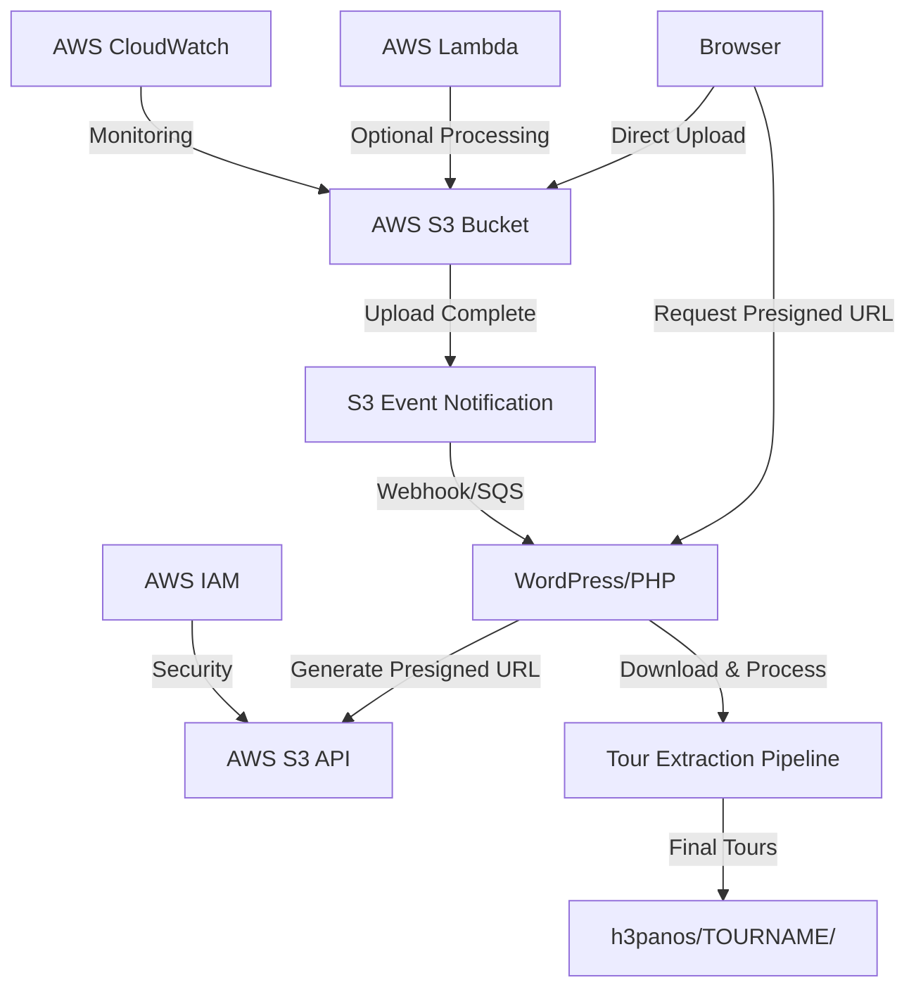
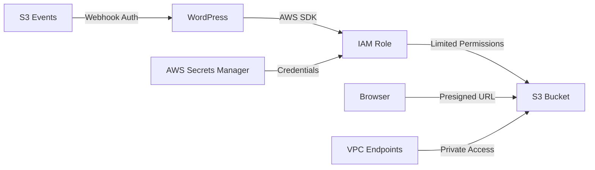

# AWS S3 Integration Architecture for H3 Tour Management

## Executive Summary

This document outlines a comprehensive AWS S3 integration architecture to solve large file upload issues (300MB+) on the Pantheon platform. The solution enables direct browser-to-S3 uploads bypassing server disk space limitations while maintaining all existing tour management functionality.

## Current System Analysis

### Existing Upload Flow
```
Browser → WordPress (Chunked) → Temp Storage → Tour Extraction → h3panos/TOURNAME/
```

### Current Issues
- Pantheon disk space limits (~512MB tmp directory)
- Failed chunked uploads for files >300MB
- Server memory exhaustion during large file processing
- Upload timeouts for large files

### Existing Strengths to Preserve
- Nested ZIP extraction: `TOURNAME.zip → TOURNAME/ → Web.zip → Web/ → tour files`
- Streaming extraction for memory efficiency
- Tour management features (rename, delete, user assignments)
- Analytics and user tracking

## S3 Integration Architecture

### 1. High-Level Architecture



### 2. Data Flow Design

#### Phase 1: Upload Initialization
1. **Client Request**: User selects tour file in WordPress admin
2. **Presigned URL Generation**: WordPress generates S3 presigned URL
3. **Client Configuration**: Browser receives upload parameters

#### Phase 2: Direct S3 Upload
1. **Direct Upload**: Browser uploads directly to S3 (multipart for >100MB)
2. **Progress Tracking**: Real-time upload progress via S3 APIs
3. **Upload Completion**: S3 confirms successful upload

#### Phase 3: Processing Pipeline
1. **Event Notification**: S3 triggers WordPress webhook/SQS message
2. **File Download**: WordPress downloads from S3 for processing
3. **Tour Extraction**: Existing extraction pipeline processes the file
4. **Cleanup**: Remove S3 temporary file after successful processing

### 3. Component Architecture

#### 3.1 WordPress Integration Layer

```php
class H3TM_S3_Integration {
    private $s3_client;
    private $bucket_name;
    private $aws_region;

    // Presigned URL generation
    public function generate_presigned_upload_url($tour_name, $file_size);

    // Upload status tracking
    public function track_upload_progress($upload_id);

    // Post-upload processing
    public function process_uploaded_tour($s3_key);

    // Fallback handling
    public function should_use_s3_upload($file_size);
}
```

#### 3.2 S3 Bucket Configuration

```yaml
Bucket Structure:
  h3-tour-uploads/
    temp/                    # Temporary uploads
      {upload_id}/
        {filename}
    processed/               # Successfully processed files
      {tour_name}/
        {filename}
    failed/                  # Failed processing attempts
      {upload_id}/
        {filename}
```

#### 3.3 Security Architecture



## Implementation Specifications

### 1. API Endpoints

#### Generate Presigned URL
```
POST /wp-admin/admin-ajax.php
Action: h3tm_get_s3_upload_url

Request:
{
    "tour_name": "example-tour",
    "file_name": "tour.zip",
    "file_size": 524288000,
    "file_type": "application/zip"
}

Response:
{
    "success": true,
    "data": {
        "upload_url": "https://s3.amazonaws.com/...",
        "fields": {
            "key": "temp/uuid/tour.zip",
            "policy": "...",
            "x-amz-algorithm": "...",
            "x-amz-credential": "...",
            "x-amz-date": "...",
            "x-amz-signature": "..."
        },
        "upload_id": "uuid-string",
        "multipart": true,
        "chunk_size": 104857600
    }
}
```

#### Upload Status Check
```
GET /wp-admin/admin-ajax.php
Action: h3tm_check_s3_upload

Request:
{
    "upload_id": "uuid-string"
}

Response:
{
    "success": true,
    "data": {
        "status": "uploading|completed|processing|failed",
        "progress": 75,
        "message": "Upload 75% complete"
    }
}
```

#### Process S3 Upload
```
POST /wp-admin/admin-ajax.php
Action: h3tm_process_s3_upload

Request:
{
    "upload_id": "uuid-string",
    "s3_key": "temp/uuid/tour.zip",
    "tour_name": "example-tour"
}

Response:
{
    "success": true,
    "data": {
        "message": "Tour processing initiated",
        "job_id": "processing-uuid"
    }
}
```

### 2. Security Model

#### IAM Policy for WordPress
```json
{
    "Version": "2012-10-17",
    "Statement": [
        {
            "Effect": "Allow",
            "Action": [
                "s3:PutObject",
                "s3:PutObjectAcl",
                "s3:GetObject",
                "s3:DeleteObject"
            ],
            "Resource": "arn:aws:s3:::h3-tour-uploads/temp/*"
        },
        {
            "Effect": "Allow",
            "Action": [
                "s3:ListBucket"
            ],
            "Resource": "arn:aws:s3:::h3-tour-uploads",
            "Condition": {
                "StringLike": {
                    "s3:prefix": ["temp/*"]
                }
            }
        }
    ]
}
```

#### Presigned URL Security
- **Expiration**: 1 hour maximum
- **Size Limits**: 2GB maximum file size
- **File Type Validation**: ZIP files only
- **Rate Limiting**: 5 uploads per user per hour
- **Key Restrictions**: UUID-based keys only

#### Credential Management
```php
class H3TM_AWS_Credentials {
    private function get_credentials() {
        // Priority order:
        // 1. AWS Secrets Manager (production)
        // 2. WordPress options (encrypted, development)
        // 3. Environment variables (fallback)
    }

    private function encrypt_credentials($data) {
        // Use WordPress auth keys for encryption
    }
}
```

### 3. File Lifecycle Management

#### Upload Lifecycle
```
1. Generate presigned URL (expires 1 hour)
2. Browser uploads to S3 temp/ directory
3. S3 event triggers WordPress webhook
4. WordPress downloads and processes file
5. Move processed file to processed/ directory
6. Clean up temp/ directory
```

#### Cleanup Strategy
```php
class H3TM_S3_Cleanup {
    // Clean up temp files older than 24 hours
    public function cleanup_temp_files();

    // Archive processed files older than 30 days
    public function archive_processed_files();

    // Clean up failed uploads older than 7 days
    public function cleanup_failed_uploads();
}
```

#### S3 Lifecycle Policies
```json
{
    "Rules": [
        {
            "ID": "TempFileCleanup",
            "Status": "Enabled",
            "Filter": {"Prefix": "temp/"},
            "Expiration": {"Days": 1}
        },
        {
            "ID": "ProcessedFileArchive",
            "Status": "Enabled",
            "Filter": {"Prefix": "processed/"},
            "Transitions": [
                {
                    "Days": 30,
                    "StorageClass": "STANDARD_IA"
                },
                {
                    "Days": 90,
                    "StorageClass": "GLACIER"
                }
            ]
        }
    ]
}
```

## Integration Points

### 1. Frontend JavaScript Updates

#### Enhanced Upload Form
```javascript
class H3TM_S3_Uploader {
    constructor(options) {
        this.useS3 = options.fileSize > 50 * 1024 * 1024; // 50MB threshold
        this.chunkSize = 10 * 1024 * 1024; // 10MB chunks for S3
    }

    async uploadFile(file, tourName) {
        if (this.useS3) {
            return await this.uploadToS3(file, tourName);
        } else {
            return await this.uploadChunked(file, tourName); // Existing method
        }
    }

    async uploadToS3(file, tourName) {
        // 1. Get presigned URL from WordPress
        // 2. Upload directly to S3 (multipart if >100MB)
        // 3. Monitor progress
        // 4. Notify WordPress of completion
    }
}
```

### 2. Backend PHP Integration

#### Modified Tour Manager
```php
class H3TM_Tour_Manager_S3 extends H3TM_Tour_Manager {
    public function upload_tour($tour_name, $file, $upload_source = 'local') {
        switch ($upload_source) {
            case 's3':
                return $this->process_s3_upload($tour_name, $file);
            case 'local':
            default:
                return parent::upload_tour($tour_name, $file); // Existing method
        }
    }

    private function process_s3_upload($tour_name, $s3_file_info) {
        // 1. Download from S3 to temp location
        // 2. Process with existing extraction logic
        // 3. Clean up S3 temp file
        // 4. Return result
    }
}
```

### 3. Admin Interface Updates

#### Upload Method Selection
```php
public function render_upload_form() {
    ?>
    <div class="h3tm-upload-method">
        <h3>Upload Method</h3>
        <label>
            <input type="radio" name="upload_method" value="auto" checked>
            Automatic (S3 for large files, chunked for small files)
        </label>
        <label>
            <input type="radio" name="upload_method" value="s3">
            Always use S3 Direct Upload
        </label>
        <label>
            <input type="radio" name="upload_method" value="chunked">
            Always use Chunked Upload
        </label>
    </div>
    <?php
}
```

## Monitoring and Error Handling

### 1. CloudWatch Metrics
- Upload success/failure rates
- Upload duration metrics
- File size distribution
- Error rate monitoring

### 2. Error Handling Strategy

#### Upload Failures
```php
class H3TM_S3_Error_Handler {
    public function handle_upload_failure($upload_id, $error) {
        // 1. Log detailed error information
        // 2. Attempt fallback to chunked upload
        // 3. Notify user of fallback
        // 4. Clean up failed S3 upload
    }

    public function handle_processing_failure($s3_key, $error) {
        // 1. Move file to failed/ directory
        // 2. Log processing error
        // 3. Notify administrator
        // 4. Provide manual retry option
    }
}
```

#### Fallback Mechanisms
1. **S3 Upload Failure** → Fall back to chunked upload
2. **Processing Failure** → Retry processing up to 3 times
3. **Download Failure** → Retry download with exponential backoff
4. **Extraction Failure** → Use existing error handling

### 3. Logging and Debugging

#### Enhanced Logging
```php
class H3TM_S3_Logger extends H3TM_Logger {
    public function log_s3_upload($upload_id, $status, $metadata = []) {
        $this->log('s3_upload', [
            'upload_id' => $upload_id,
            'status' => $status,
            'file_size' => $metadata['file_size'] ?? 0,
            'duration' => $metadata['duration'] ?? 0,
            'method' => 's3_direct'
        ]);
    }
}
```

## Cost Analysis

### S3 Storage Costs (Monthly)
- **PUT Requests**: $0.0005 per 1,000 requests
- **Storage**: $0.023 per GB (Standard)
- **Data Transfer**: $0.09 per GB (out to internet)

### Example Cost for 100 Tours/Month (500MB average)
- **Storage**: 50GB × $0.023 = $1.15
- **PUT Requests**: 100 × $0.0005 = $0.05
- **Transfer**: 50GB × $0.09 = $4.50
- **Total**: ~$5.70/month

### Cost Comparison
- **Current Pantheon Issues**: Failed uploads, support tickets, lost productivity
- **S3 Solution**: Predictable monthly cost, reliable uploads, improved UX

## Implementation Roadmap

### Phase 1: Core S3 Integration (Week 1-2)
- [ ] AWS SDK integration
- [ ] Presigned URL generation
- [ ] Basic S3 upload functionality
- [ ] Error handling framework

### Phase 2: Frontend Integration (Week 3)
- [ ] Enhanced upload form
- [ ] Progress tracking
- [ ] Fallback mechanisms
- [ ] User interface improvements

### Phase 3: Advanced Features (Week 4)
- [ ] Multipart uploads for large files
- [ ] Upload resume functionality
- [ ] Admin configuration panel
- [ ] Monitoring and logging

### Phase 4: Production Deployment (Week 5)
- [ ] Security audit
- [ ] Performance testing
- [ ] Backup/rollback procedures
- [ ] Documentation and training

### Phase 5: Optimization (Week 6)
- [ ] Lambda processing integration
- [ ] CDN integration for downloads
- [ ] Advanced monitoring
- [ ] Cost optimization

## Security Considerations

### 1. Data Protection
- **Encryption in Transit**: HTTPS for all communications
- **Encryption at Rest**: S3 server-side encryption
- **Access Logging**: CloudTrail for all S3 access
- **Data Residency**: Configure S3 region per requirements

### 2. Access Control
- **Principle of Least Privilege**: Minimal IAM permissions
- **Temporary Access**: Short-lived presigned URLs
- **User Authentication**: WordPress user validation
- **Rate Limiting**: Prevent abuse

### 3. Compliance
- **GDPR**: Data retention and deletion policies
- **SOC 2**: AWS compliance inheritance
- **Audit Trail**: Complete logging of all operations

## Conclusion

This S3 integration architecture provides a robust solution to the large file upload challenges on Pantheon while maintaining all existing functionality. The phased implementation approach ensures minimal disruption to current operations while providing immediate benefits for large file uploads.

Key benefits:
- **Reliability**: Eliminates Pantheon disk space issues
- **Scalability**: Handles files up to 2GB+
- **Performance**: Direct browser-to-S3 uploads
- **Cost-Effective**: Predictable S3 pricing model
- **Maintainability**: Clean separation of concerns
- **Security**: Enterprise-grade AWS security model

The architecture is designed to be backward-compatible, allowing for gradual migration and providing fallback mechanisms for edge cases.